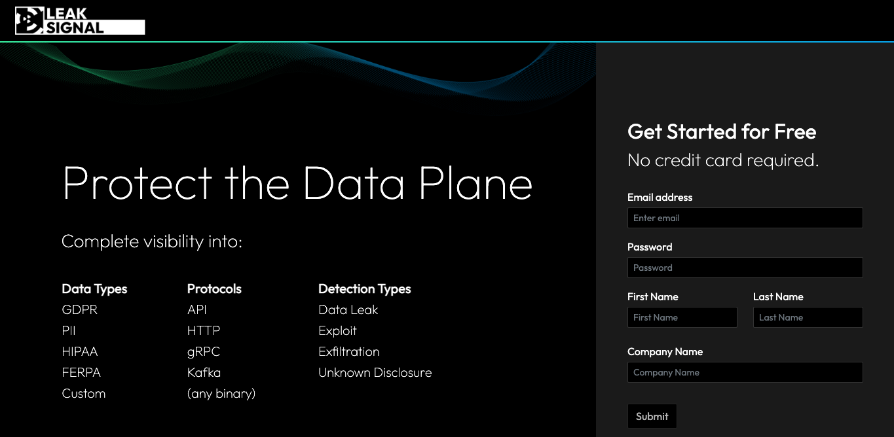
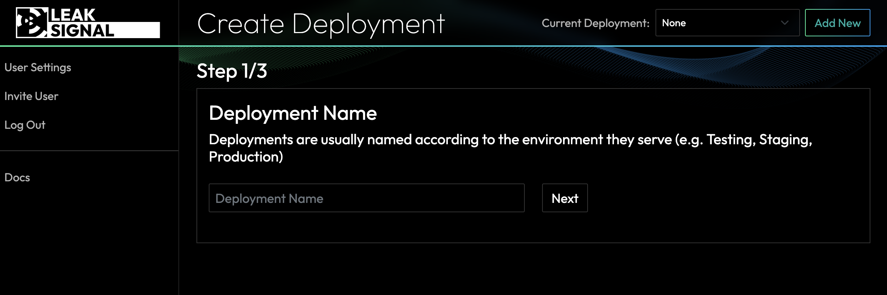
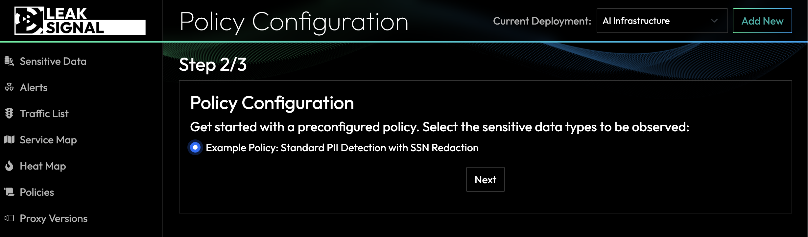
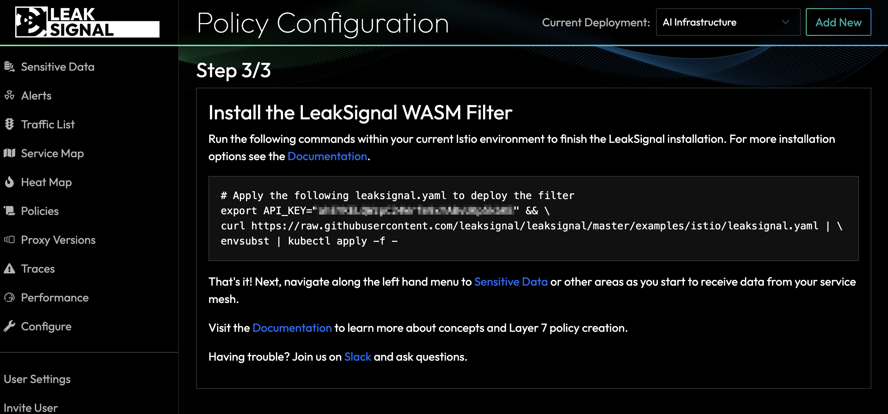

In 2022, researchers from the University of Texas at Austin were able to hack into the GPT-3 language model and extract personal information from it, including names, addresses, and phone numbers. The researchers were able to do this by exploiting a vulnerability in the GPT-3 model that allowed them to inject malicious code into the model itself. Once the malicious code was injected, the researchers were able to control the model and extract sensitive data.

This is just one example of how LLMs (large language models) can be exploited to divulge sensitive data. As these models become more powerful and widely used, it's important to be aware of the general risks associated with them:

* Bias: LLMs are trained on data that is collected from the real world. This data can be biased, and this bias can be reflected in the output of the LLM. For example, an LLM that is trained on a dataset of news articles may be biased towards certain political viewpoints.
* Misinformation: LLMs can generate text that is factually incorrect. This is because they are trained on data that may contain misinformation. For example, an LLM that is trained on a dataset of social media posts may generate text that is false or misleading.
* Privacy: Large language models can store and retain data from user interactions, which raises concerns about privacy and data security. Sensitive information shared during conversations could be at risk if not handled properly.
* Security: LLMs can be hacked or manipulated. This can allow attackers to gain access to sensitive information or to control the behavior of the LLM. For example, an attacker could hack into an LLM and use it to generate text that is harmful or offensive.

## Running Your Own LLM

Large language models (LLMs) generally require significant GPU infrastructure to operate. We're now starting to see ports, like [llama.cpp](https://github.com/ggerganov/llama.cpp), that make it possible to run LLMs on different hardware — including Raspberry Pis, laptops and commodity servers.
Self-hosted LLMs are now a reality and there are few proposals and strategies to proactively protect them from divulging PII and other sensitive data.

*That's where LeakSignal can help*

## Detecting Sensitive Data Divulgence

Signup for a free account at https://app.leaksignal.com/register

Give your deployment a name:

Choose the type of sensitive data detection policy you wish to deploy. This one detects all basic sensitive data and redacts social security numbers (as an example)

Deploy the LeakSignal filter by copy and pasting the configuration with your API key already embedded.

From here, use the Service Map to understand sensitive data flows and configure alerts in the [Policy](/Policy) to receive an SMS or email alert when sensitive data is emitted from your AI workload.