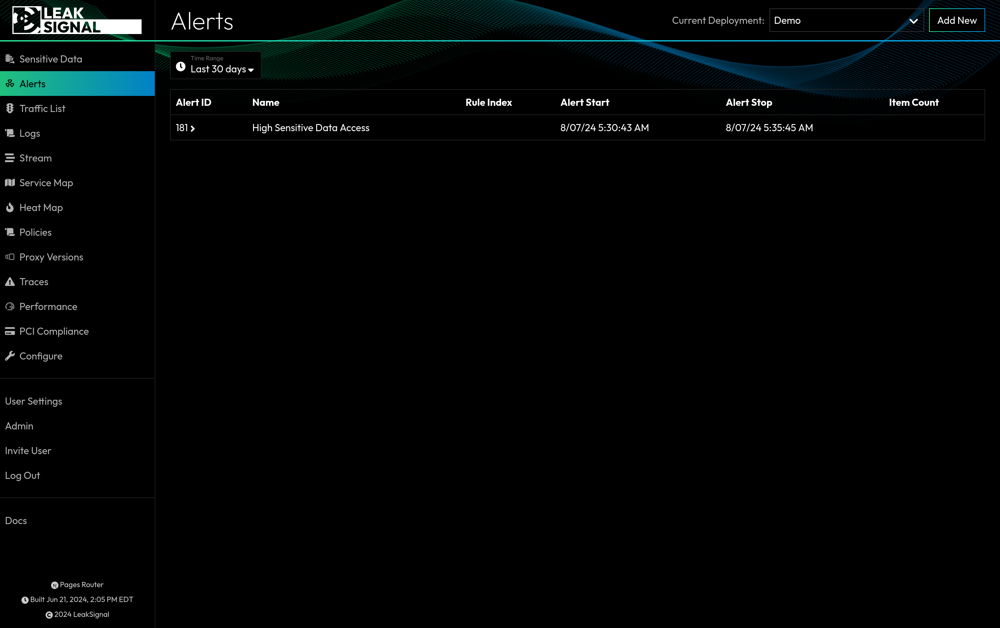

The Alerts page surfaces instances of anomalous data access and data exfiltration, based on the deployment's active policy configuration. The page displays a list of all active alerts.

## Alert Index Filters

| Filter | Description |
| --- | --- |
| Time Range | Filter by time range. |

## Alert Item Filters

Within each alert are severl Alert Data Items, which themselves can be filtered.

| Filter | Description |
| --- | --- |
| Time Range | Filter by time range. |
| Historical | Toggle between displaying only the items which are currently active, or all items including those which have been resolved. |
| Group ID | Filter by the Group ID of the alert. |
| ID | Filter by the ID of the alert. |
| Count ID | Filter by the Count ID of the alert. |