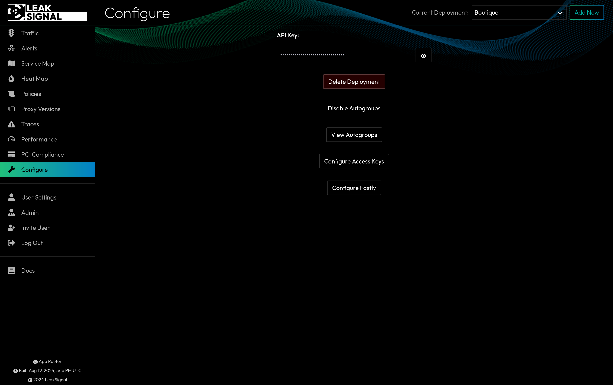

The Configure page contains configuration options for the current deployment, including your API Key, options to delete the deployment or disable autogroups, as well as the ability to view current autogroups, configure access keys, and configure Fastly configurations. 