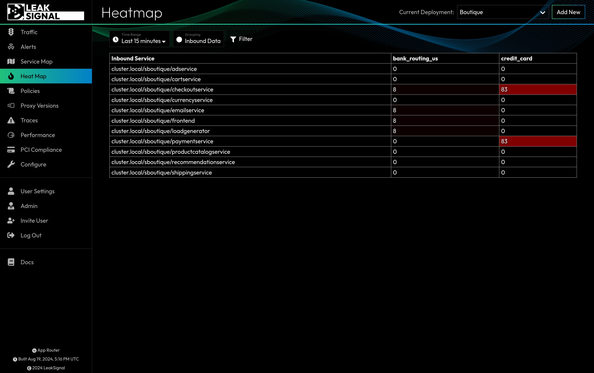

The Heatmap displays sensitive data access in a matrix format. Each PII Category is is displayed in a column, and can be grouped in rows by the Inbount Service, Outbound Service, IP Address or Token. The heatmap is color coded to indicate the number of matches for each cell, with brighter colors indicating more matches.

Clicking any cell will take you to the [Traffic Page](Traffic.md) with the filters pre-applied to view the corresponding traffic.

## Heatmap Filters

| Filter | Description |
| --- | --- |
| Time Range | Filter by time range. |
| Grouping | Organize data in rows by Inbound Service, Outbound Service, IP Address, or Token. |
| Token | Filter by token. |
| IP | Filter by origin IP. |
| API Endpoint | Filter by the full path of the HTTP request. |
| PII Category | Filter by matched PII Category. |