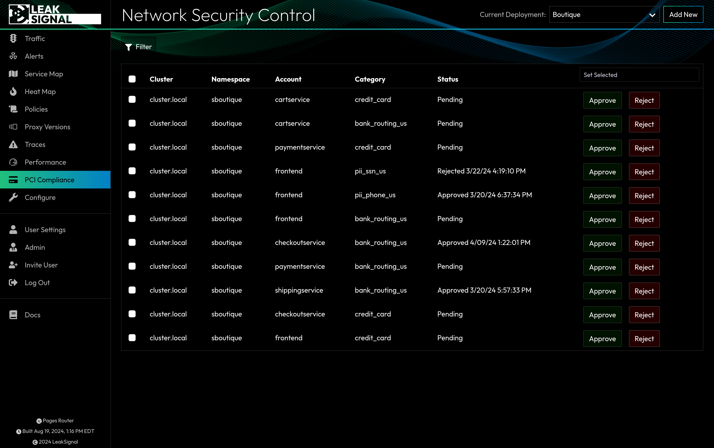

The Network Security Control page lists all active NSC Tickets. An NSC Ticket is a request for permission for one container to access a certain category of data, with the option to approve or reject the requets.

## NSC Ticket Index Filters

| Filter | Description |
| --- | --- |
| Local Service | Filter by the local service requesting access. |
| Peer Service | Filter by the peer service being accessed. |
| PII Category | Filter by the category of data being accessed. |
| Status | Filter by the status of the ticket (Approved, Rejected or Pending). |