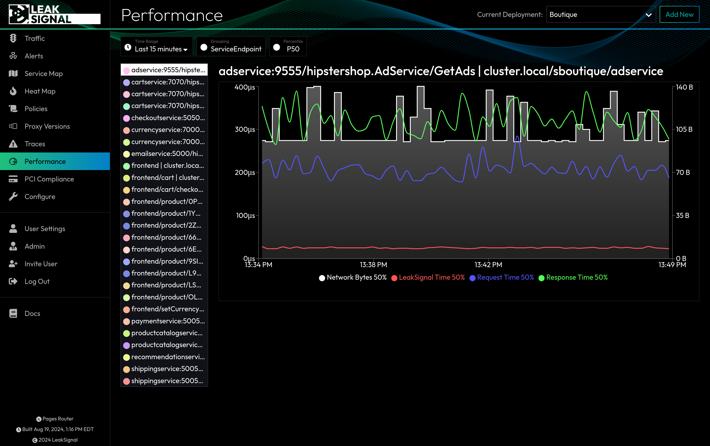

The Performance page displays a summary of the performance characteristics of the Proxy and its current configured Policy. If you are experiencing performance issues with the Proxy, this page can help you identify the source of the bottleneck.

## Performance Metrics

Each metric is displayed as a time series graph, with four data series overlaid. 

| Metric | Description |
| --- | --- |
| Network Bytes | The total number of bytes analyzed by the Proxy. |
| LeakSignal Time | Total time spent (microseconds) analyzing data by the Proxy. |
| Request Time | Total time elapsed receiving request data. |
| Response Time | Total time between beginning to receive response data and completing the response. |

## Performance Filters

| Filter | Description |
| --- | --- |
| Time Range | Filter by time range. |
| Grouping | Group performance metrics by Service Endpoint, Service, Service Group, or Global. |
| Percentile | Display data at P50, P90, or P99. |