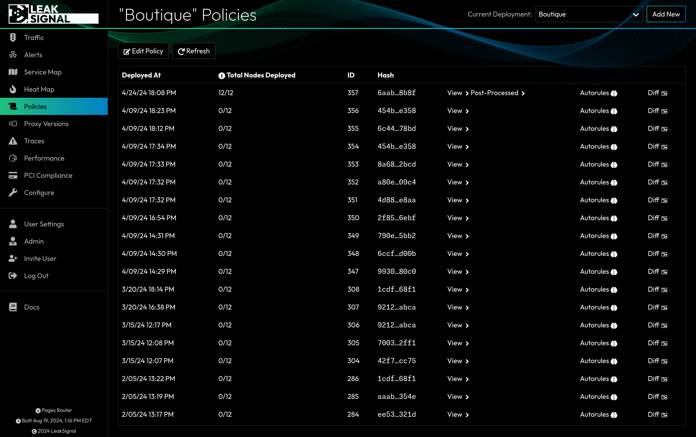

The Policy page displays a list of all policies that have been created for the active deployment. The most recent policy is always the active one. You can also view previous policies, diff them against the active policy, and revert to a previous policy (which will create a new copy rather than activating the old one).