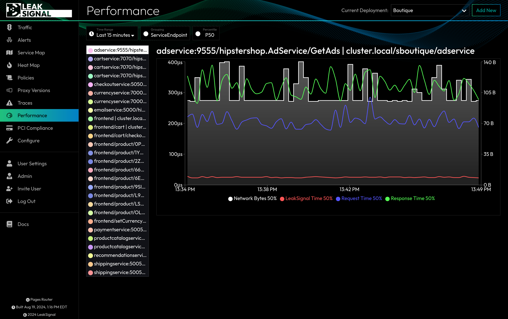

Analyzes the performance of the LeakSignal proxy, including network bytes processed, request/response times, and the impact of these metrics on overall system performance.

**Page:** [Performance](../Performance)

**Filters:** Time Range, Grouping, Percentile (P50, P90, P99)