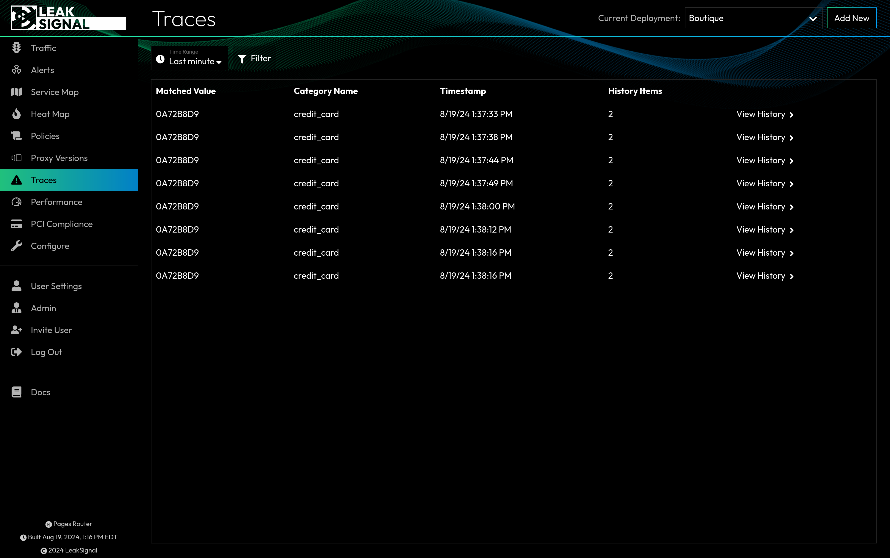

Traces track the flow of individual pieces of data throughout your application. Each trace includes a list of the services that the data passed through, as well as the PII Categories that were matched. Clicking on a trace will show you a miniature service map including only the services that handled the data.

## Traces Filters

| Filter | Description |
| --- | --- |
| Time Range | Filter by time range. |
| PII Category | Filter by matched PII Category. |
| Value | Filter by the value of the matched data. |