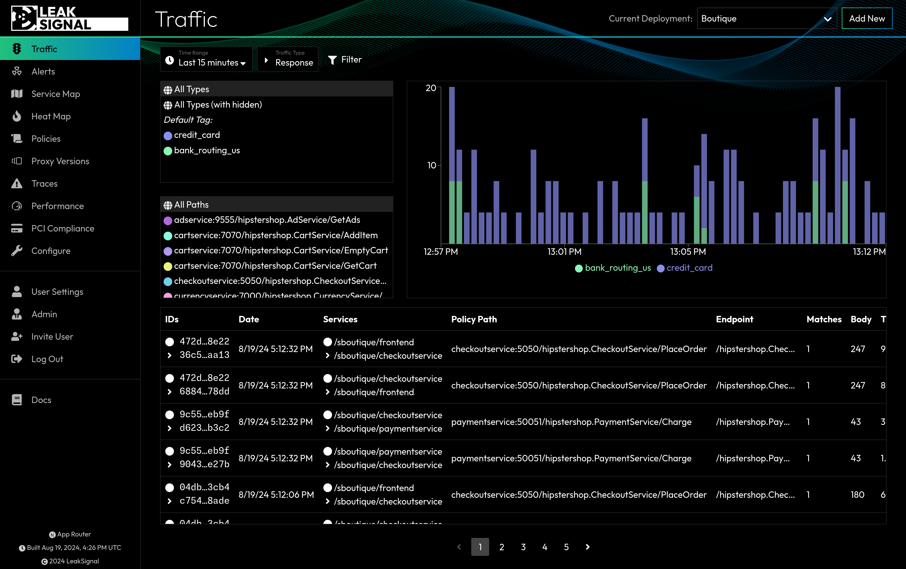

The Traffic page is the first page the users sees upon logging in. It displays a list of all traffic that has been captured by the LeakSignal Proxy.

The default view displays a list of all HTTP Traffic. The user can switch between HTTP, Stream, and Log traffic types using the filters at the top of the page.

## Traffic Filters

There are three traffic types - HTTP (aka Response), Stream, and Logs. The filters that are available differ based on the traffic type, some are common to all.

When changing traffic type, filters that apply to multiple traffic types will remain active and filters that are not applicable to the new traffic type will become inactive and visually greyed out, but will become active again if the traffic type is changed back to an applicable type.

Note: The HTTP traffic type has a different page layout to accommodate the PII Graph widget, and the PII Category and Policy Path filters are displayed in the top-left of the page as selectors rather than in the filter selector. Functionality otherwise remains the same.

| Filter | Description | HTTP | Stream | Logs |
| --- | --- | --- | --- | --- |
| Time Range | Filter by time range. | ✓ | ✓ | ✓ |
| PII Category | Filter by matched PII Category or Tag. | ✓ | ✓ | ✓ |
| Local Name | Filter by the name of the service receiving the traffic. | ✓ | ✓ | |
| Peer Name | Filter by the name of the service the traffic originated from. | ✓ | ✓ | |
| Match Value | Filter by the value of the matched data. | ✓ | ✓ | |
| Policy Path | Filter by the full path of the HTTP request. | ✓ | | |
| Token | Filter by token. | ✓ | | |
| IP | Filter by origin IP. | ✓ | | |
| JSON Path | Filter by the JSON path of the matched data. | ✓ | | |
| Content Type | Filter by the content-type of the HTTP request or response. | ✓ | | |
| Request Header | Filter by HTTP request headers. | ✓ | | |
| Response Header | Filter by HTTP response headers. | ✓ | | |
| Traffic Direction | Filter by traffic direction (inbound or outbound). | ✓ | | |
| Status | Filter by HTTP status code. | ✓ | | |
| Namespace | Filter by the namespace of the workload. | | | ✓ |
| Workload | Filter by the name of the workload. | | | ✓ |
| Container | Filter by the name of the container. | | | ✓ |