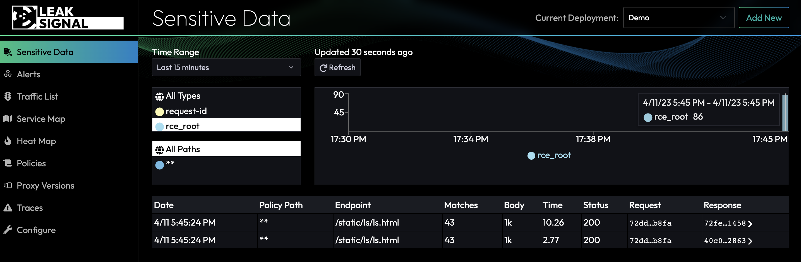
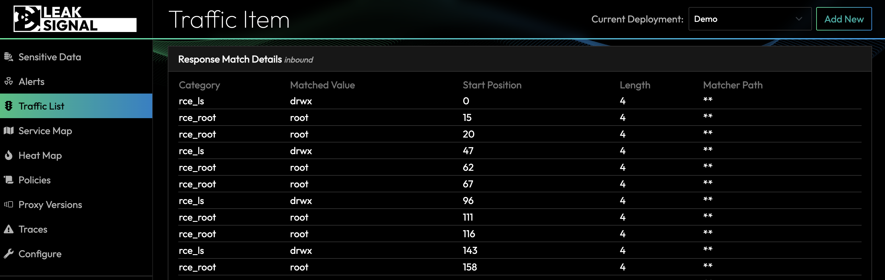

## How Ransomware Works

According to the 2021 Verizon Data Breach Investigations Report, web applications were the top attack vector for ransomware, accounting for 29% of all incidents analyzed. Similarly, a report from cybersecurity firm CrowdStrike found that 33% of ransomware incidents involved attackers exploiting vulnerabilities in web applications.

Ransomware attacks on public facing web infrastructure begin with a feeback loop. There’s no way for a single human to scan all the web infrastructure so they employ scanning tools to find an [RCE](/Usecases/Ransomware%20and%20RCEs) or other vulnerability. Here are a few examples of tools and scanners available that can check for vulnerable web servers:

1. Nmap: Nmap is a network exploration and security auditing tool that can be used to scan for open ports and services on a web server. By identifying open ports, it can help to identify any services that might be vulnerable to attacks.
2. OpenVAS: OpenVAS is an open-source vulnerability scanner that can be used to scan web servers and web applications for known vulnerabilities. It can identify issues such as outdated software versions, misconfigurations, and insecure settings.
3. Nikto: Nikto is a web server scanner that can be used to identify vulnerabilities and misconfigurations in web servers. It can scan for over 6700 potentially dangerous files and scripts on web servers, including server misconfigurations, outdated software versions, and insecure settings.
4. Burp Suite: Burp Suite is a web application security testing tool that can be used to identify vulnerabilities in web applications. It can scan for a wide range of vulnerabilities, including cross-site scripting (XSS), SQL injection, and file inclusion vulnerabilities.
5. Metasploit: Metasploit is a penetration testing framework that can be used to identify vulnerabilities in web servers and web applications. It includes a variety of tools and modules that can be used to scan for and exploit vulnerabilities in target systems.
6. Cobalt Strike: In recent years, threat actors have increasingly used Cobalt Strike as part of their attack chain, particularly in ransomware attacks. They use the tool to gain initial access to a network, move laterally through the network, and deploy ransomware to encrypt files and demand a ransom payment.

When attackers run one of the aforementioned tools and actually find a vulnerable web server, they receive the results of a system command that has been executed on the vulnerable service. This could be in the form of a `ls`, `cat`, or `ifconfig` linux command. Here's an example of the ls command output from a scanning attack:


The commands will generate responses with unique signals that would never be seen in normal traffic. One sure fire way to detect this type of attack in real time is to create a matcher category for signs of ransomware. Here is an example policy that will detect the majority of ransomware feedback loops that attackers are hoping to see after running their favorite scanning tool:

```yaml
  rce_ls:
    - regex: "(?-u:\\b)drwx"
  rce_ifconfig:
    - regex: "(?-u:\\b)ether "
  rce_root:
    - regex: "(?-u:\\b)root(?-u:\\b)"
  rce_privatekey:
    - regex: PRIVATE KEY
```

:::note
See [Policy](/Policy) documentation for more information on how policies work.
:::

When any of the above matching rules are triggered, LeakSignal will fire an alert in the COMMAND dashboard (along with sending you an SMS and email).



After clicking on the Traffic Item details, it's easy to see what was matched in the response to determine the type of malicious command that ran on the service:



This is just the beginning of a comprehensive LeakSignal policy that can detect the initial feedback loop of any ransomware attack.

## Remote Command Execution (RCE)

Remote Command Execution (RCE) is one of the most dangerous types of vulnerabilities. It allows attackers to execute commands on a server by simply requesting a URL with a crafted payload. To execute an RCE and eventually takeover a machine, one simply sends a request to a URL similar to the following:

```
http:/yourwebsite.com/vulnerableAPI/attack?search=<query>
```

Using the latest Text4Shell vulnerability as an example, an attacker would send the following request to an exposed server:

```
http:/yourwebsite.com/vulnerableAPI/attack?search=${script:javascript:java.lang.Runtime.getRuntime().exec('ls -e /bin/sh')}
```

These types of requests trigger undetected exploits in underlying production code. In the cases of log4shell in 2021 and the Equifax breach of 2017, RCEs were found in the underlying components that were widely used across many public facing software systems worldwide - and these types of exploits are [only getting worse](https://www.cisa.gov/known-exploited-vulnerabilities-catalog).

## RCE Detection

RCE detection can be difficult due to many factors. Some detection solutions require agent installation or instrumentation of an existing codebase. These solutions become cumbersome, hard to implement consistently across large organizations, and are an overall maintenance nightmare.

Additionally, third party (supply chain) scanning is a good preventitive measure, but not effective in preventing zero days and flawed API logic susceptible to an RCE attack.
There are no silver bullets to defend against every type of RCE, but response analysis is one of the most efficacious approaches.

When attackers are probing to check for RCE vulnerabilities, they're looking for indicators of a successful exploit. Many probing and scanning tools send a malicious request to check for system output. This could be in the form of a `ls`, `cat`, or `ifconfig` linux command. The commands will generate responses with unique signals that can be detected with low false positive rates.
Here's an example of the `ls` command used in a scanning attack:


To detect this type of infrastructure probing, a LeakSignal category can be created in the policy to detect the signature of `ls` output.

```yaml
categories:
  rce_ls_root:
    - regex: "\\broot root\\b"
```

:::note
See [Policy](/Policy) documentation for more information on how policies work.
:::

Additionally, response signatures can be customized to match the output of specific systems like Microsoft Exchange. The following example shows how exploitation of ProxyLogin and ProxyNotShell could be detected in the outgoing HTTP response.


```yaml
categories:
  rce_ls_root:
    - regex: "\\bnt authority\/system\\b"
```

LeakSignal can detect response signatures across all mesh API, HTTP, gRPC and WebSocket traffic.