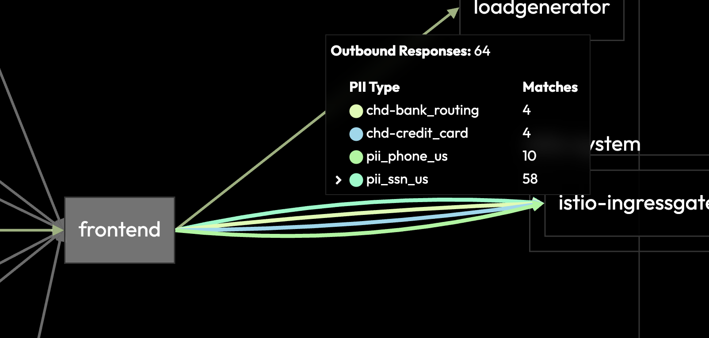
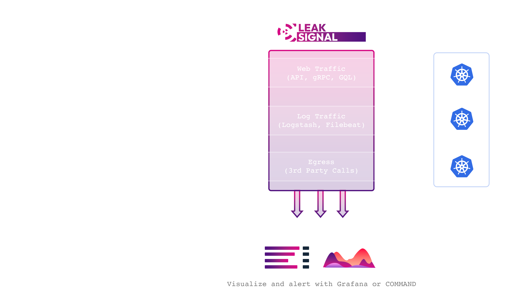

# Getting Started

🔍 Unlock real-time visibility into your sensitive data flows.

LeakSignal provides real-time visibility and governance for sensitive data in your microservices. This openly distributed solution empowers operations engineers (SRE, DevOps, Platform Eng. etc) to combat API exploits, misconfigurations, and data leakage with ease.

## Features

- **Real-Time Analysis**: Fast, inline Layer 4 and 7 request/response analysis.
- **Configurable Rules**: Easy-to-configure rules for detecting and analyzing sensitive data (e.g., PII).
  - Detect part numbers, account numbers, patient info, grades, dates, email addresses, and more.
- **Comprehensive Dashboard**: Cloud-based dashboard with policy editor, monitoring, and alerting.
- **Seamless Integration**: Expose analysis metrics via Envoy for integration with OpenTelemetry, Prometheus, etc.

## Installation

LeakSignal can deploy in a variety of environments -- Istio, OpenShift Service Mesh, NGINX/NGINX Ingress, Lambda, and more.

See detailed installation instructions [here](./Deployment/Istio%20&%20OSSM).

Here's the Markdown for three marketplace boxes with their respective logos and links to install LeakSignal:

---

## Install LeakSignal from Your Preferred Marketplace

[Install LeakSignal on AWS](https://aws.amazon.com/marketplace/pp/prodview-4et32qmmt3yse)

[Install LeakSignal on Azure](https://azuremarketplace.microsoft.com/en-us/marketplace/apps/leaksignalinc1673983004536.leaksignal_test?tab=Overview)

[Install LeakSignal on Red Hat OpenShift](https://catalog.redhat.com/software/containers/leaksignal/leaksignal-operator/65bba2dfc5a5071d0ac06f82?architecture=amd64&image=65d63f73a90f7d622e03f5fd)

---

This Markdown will create three sections for AWS, Azure, and Red Hat marketplaces, each with their logos and links to install LeakSignal.

## Overview

LeakSignal detects sensitive data within mesh traffic. Analysis and processing of traffic are handled inline, allowing engineers to understand sensitive data emission without sending, storing, or viewing the sensitive data.

### LeakSignal Proxy

LeakSignal Proxy establishes a framework and delivery mechanism for composable inline traffic analysis and policy enforcement within an existing sidecar.

The Proxy is written in Rust and compiles to WASM (for Proxy-Wasm/Envoy) or Natively (Proxy-Wasm/Envoy/NGINX).

#### Key Functionalities:

- **Sensitive Data Observability**: Monitor and analyze sensitive data flows.
- **Data Access Management**: Track access by IP, token, and service.
- **Exfiltration Mitigation**: Prevent unauthorized data transfers.
- **Audit Trails**: Maintain logs of data access and actions.
- **Dashboard Visualization**: View data through histograms and heatmaps.
- **Rules Engine**: Set up alerts, blocks, and distributed rate limits.

### LeakSignal COMMAND

The LeakSignal Command dashboard provides real-time visibility and alerting for unauthorized data access. It's available publicly as a SaaS or on-prem solution for enterprise customers.

### Architecture

LeakSignal Proxy performs inline traffic analysis and acts as a policy enforcement point for all Layer 4 and Layer 7 traffic, including HTTP, log collection, and databases. Policies and telemetry are managed through LeakAgent or LeakSignal Command.

- **LeakAgent**: A free, on-prem Prometheus metrics adapter.
- **Command SaaS**: Cloud-hosted metrics and configuration.
- **Command On-Prem**: The self-hosted commercial offering.

### Setup Modes:

- **Local Setup**: All metrics and configuration remain on-prem.
- **Cloud Setup**: Metrics and configuration are managed in the cloud with telemetry sent to the LeakSignal Command SaaS.

## Test and Configure L7 Policy

Verify the filter is running, then configure policies to check for specific sensitive data types or patterns. For preconfigured and performance-tested policies, see [LeakSignal Policies](Policy/Overview).

## Commercial Support

LeakSignal, Inc offers support and self-hosted versions of the cloud dashboard. Contact us at <sales@leaksignal.com>.

## License

Licensed under the Apache License, Version 2.0. See the License for the specific language governing permissions and limitations under the License.
